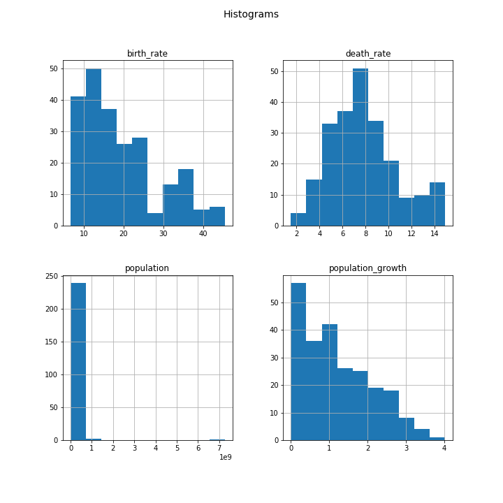

## Countries

Using SQLite in Python, I analyze country data. 

- First, I look for anomolies (outliers) in the data.

- Then I visualize the birth rates, death rates, populations, and poulation growths using histograms.

- Next, I calculate the population density for each country, and show the 10 most densely populated countries.

- Lastly, I calculate the water to land ratio, and show the 10 countries with the highest water to land ratios.